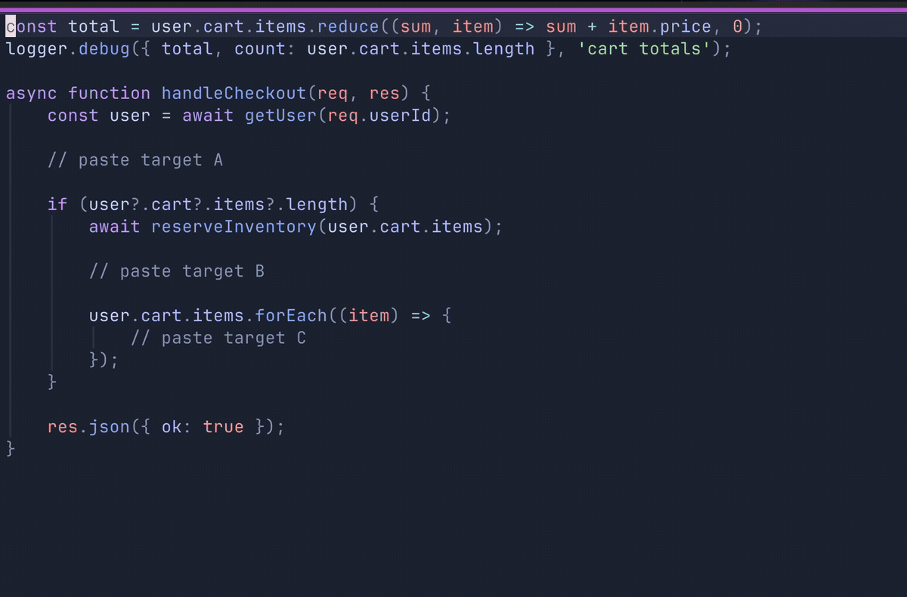

# smart-paste.nvim

Pasted code automatically lands at the correct indentation level.

  



## Features

- Intercepts `p` / `P` / `gp` / `gP` so linewise pasted code lands at the right indent level automatically.
- Adds `]p` / `[p` to paste charwise content as a correctly indented new line below/above.
- Three-tier indent strategy: `indentexpr` -> treesitter scope analysis -> heuristic fallback.
- Visual mode (`V` + `p`/`P`): replace selected lines with correctly indented content.
- Dot-repeat (`.`) works naturally.
- Single undo step: one `u` undoes the entire paste.
- Register-safe behavior: registers are read, never rewritten.
- Zero dependencies: pure Lua, no external plugins required.
- Zero config: call `setup()` and paste keys are enhanced.

## Installation

```lua
-- lazy.nvim
{
  'nemanjamalesija/smart-paste.nvim',
  event = 'VeryLazy',
  config = true,
}
```

Testing this Phase 6 branch before merge:

```lua
{
  "nemanjamalesija/smart-paste.nvim",
  branch = "add-structured-key-config",
  event = "VeryLazy",
  config = true,
}
```

```lua
-- packer.nvim
use {
  'nemanjamalesija/smart-paste.nvim',
  config = function()
    require('smart-paste').setup()
  end,
}
```

```vim
" vim-plug
Plug 'nemanjamalesija/smart-paste.nvim'
" then in your init.lua: require('smart-paste').setup()
```

## What's New

- New default mappings: `]p` and `[p` convert charwise yanks to smart-indented new lines below/above.
- Structured key configuration is now supported: `{ lhs, after, follow, charwise_newline }`.
- Dot-repeat and count support cover `]p`/`[p` flows.
- Backward compatibility is preserved for existing flat `keys = { 'p', 'P', ... }` configs.

## Setup

```lua
require('smart-paste').setup()
```

Default mappings are enabled automatically:
- `p`, `P`, `gp`, `gP`
- `]p`, `[p`

Optional setup:

```lua
require('smart-paste').setup({
  exclude_filetypes = {}, -- filetypes that skip smart indent
})
```

Indentation settings (`shiftwidth`, `expandtab`, `tabstop`) come from your buffer options. No plugin-specific indent config needed.

## Remapping Keys

If you set `keys`, it replaces the defaults. Use this only when you want custom key behavior.

Flat string remap:

```lua
require('smart-paste').setup({
  keys = { 'p', 'P', ']p', '[p' },
})
```

Structured remap (custom behavior flags):

```lua
require('smart-paste').setup({
  keys = {
    'p',
    { lhs = '-p', after = true, follow = false, charwise_newline = true },
  },
})
```

Shorthand remap by inheriting behavior from a built-in key:

```lua
require('smart-paste').setup({
  keys = {
    'p',
    { lhs = '-p', like = ']p' }, -- behaves like ]p (charwise newline below)
  },
})
```

## Mappings

| Mode | Key | Action |
|------|-----|--------|
| Normal | `p` | Smart paste after cursor line |
| Normal | `P` | Smart paste before cursor line |
| Normal | `gp` | Smart paste after cursor line and follow to end |
| Normal | `gP` | Smart paste before cursor line and follow to end |
| Normal | `]p` | Paste charwise content as smart-indented new line below (linewise: same as `p`) |
| Normal | `[p` | Paste charwise content as smart-indented new line above (linewise: same as `P`) |
| Visual (linewise `V`) | `p` | Replace selection with smart-indented content |
| Visual (linewise `V`) | `P` | Replace selection with smart-indented content |
| Normal | `<Plug>(smart-paste-raw-p)` | Raw `p` (bypass smart paste) |
| Normal | `<Plug>(smart-paste-raw-P)` | Raw `P` (bypass smart paste) |

Smart paste applies to linewise registers (for example: `yy`, `dd`, `2yy`, or linewise Visual `V` + `y`).
For charwise registers, `]p` and `[p` convert inline content into smart-indented new lines.
Characterwise paste on `p`/`P`/`gp`/`gP` and blockwise (`<C-v>`) paste use native Neovim behavior.

Example escape-hatch bindings:

```lua
vim.keymap.set('n', '<leader>p', '<Plug>(smart-paste-raw-p)')
vim.keymap.set('n', '<leader>P', '<Plug>(smart-paste-raw-P)')
```

## License

[MIT](LICENSE)
